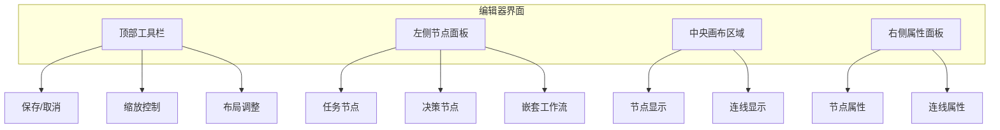
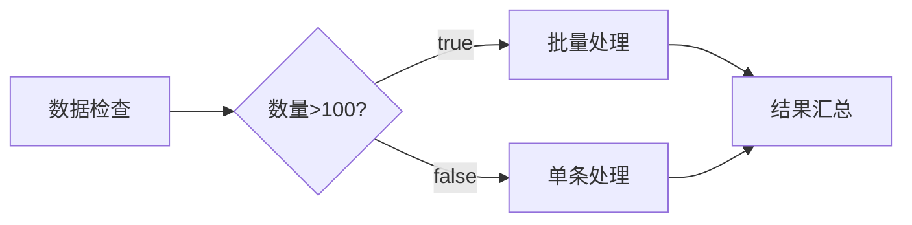
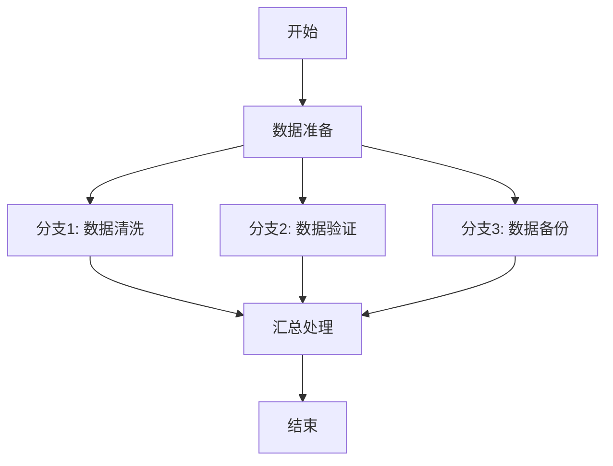
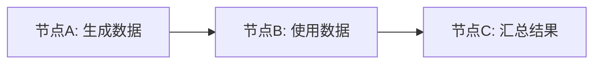
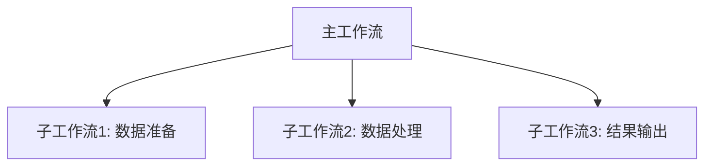
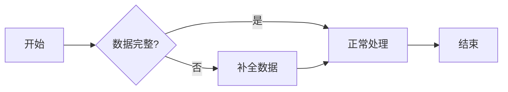
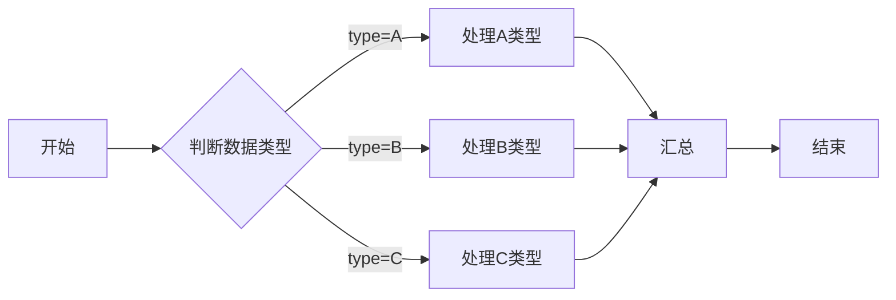
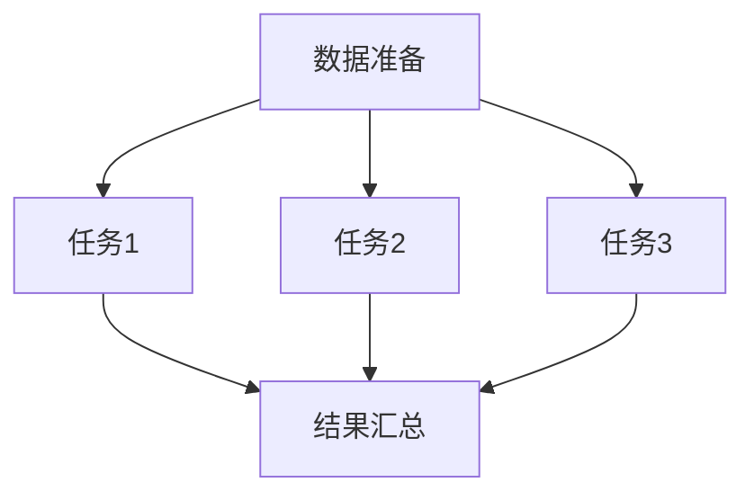
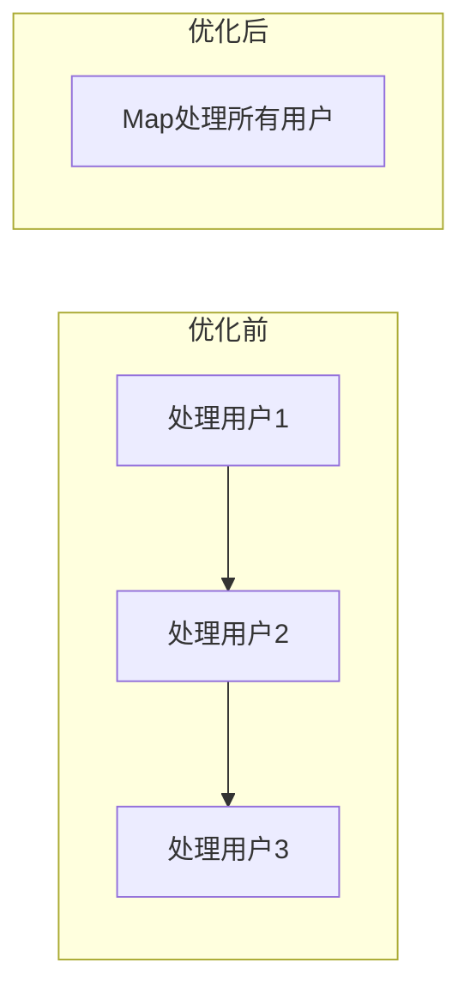

# 工作流编排

## 概述

工作流编排是 PowerJob 提供的可视化任务编排能力，通过图形化界面创建和管理 DAG（有向无环图）工作流。工作流编排器支持拖拽式操作，让复杂的业务流程设计变得简单直观。

## 进入工作流编辑器

### 创建新工作流

1. 登录 PowerJob 控制台
2. 进入「工作流管理」页面
3. 点击「新建工作流」按钮
4. 填写基本信息后进入工作流编辑器

### 编辑已有工作流

1. 在「工作流管理」列表中找到目标工作流
2. 点击「编辑」按钮进入工作流编辑器
3. 修改完成后点击「保存」

## 工作流编辑器界面

工作流编辑器由以下区域组成：



## 画布操作

### 基本操作

| 操作 | 说明 |
|------|------|
| **平移** | 按住鼠标左键拖动画布 |
| **缩放** | 使用鼠标滚轮或点击缩放按钮 |
| **自适应** | 点击「适应画布」按钮自动调整视图 |
| **网格显示** | 可切换网格背景辅助对齐 |

### 多选操作

- **框选**：按住 Shift 键拖拽鼠标框选多个节点
- **全选**：按 Ctrl+A（或 Cmd+A）全选所有节点
- **移动**：选中多个节点后可批量移动

## 节点操作

### 添加节点

**方式一：从左侧面板拖拽**

1. 在左侧节点面板中选择节点类型
2. 按住鼠标左键拖拽到画布中
3. 松开鼠标完成添加

**方式二：通过快捷菜单**

1. 在画布空白处右键点击
2. 选择「添加节点」→ 节点类型

### 节点类型详解

#### 1. 任务节点

执行具体业务逻辑的节点，对应一个已创建的任务。

**适用场景**：
- 数据处理任务
- 接口调用任务
- 文件操作任务
- 任何独立的业务逻辑

**配置选项**：
- **选择任务**：从下拉列表选择已有的任务
- **节点名称**：自定义节点显示名称（默认使用任务名称）
- **节点参数**：覆盖任务的静态参数
- **启用状态**：控制节点是否参与执行
- **允许失败跳过**：节点失败时是否继续执行后续节点

#### 2. 决策节点

基于条件判断执行路径的控制节点，使用 Groovy 脚本进行条件判断。

**适用场景**：
- 条件分支处理
- 动态路由选择
- 数据验证判断

**配置选项**：
- **节点名称**：决策节点显示名称
- **判断脚本**：Groovy 表达式，返回 true/false
- **启用状态**：控制节点是否参与执行

**脚本示例**：

```groovy
// 获取工作流上下文
def context = wfContext

// 示例1：简单条件判断
context.get("status") == "success"

// 示例2：数值比较
Integer.parseInt(context.get("count")) > 100

// 示例3：复杂条件
def status = context.get("status")
def count = Integer.parseInt(context.get("count", "0"))
status == "success" && count > 0

// 示例4：使用前置节点结果
def result = context.get("parentNodeResult")
result != null && result.contains("SUCCESS")
```

**注意事项**：
- 脚本必须返回 Boolean 类型值
- 可通过 `wfContext` 变量访问工作流上下文
- 支持所有 Groovy 语法
- 建议添加详细的注释说明判断逻辑

#### 3. 嵌套工作流节点

在当前工作流中调用另一个已创建的工作流。

**适用场景**：
- 流程模块化复用
- 复杂流程分层设计
- 多租户场景下的流程复用

**配置选项**：
- **选择工作流**：从下拉列表选择已有的工作流
- **节点名称**：自定义节点显示名称
- **启用状态**：控制节点是否参与执行
- **允许失败跳过**：子工作流失败时是否继续执行

**注意事项**：
- 不支持循环嵌套（工作流不能直接或间接引用自己）
- 子工作流会继承父工作流的上下文
- 嵌套层级建议不超过 3 层

### 节点配置

#### 启用/禁用节点

每个节点都可以独立控制启用状态：

- **启用**：节点正常参与工作流执行
- **禁用**：节点被跳过，不影响工作流整体执行

**操作方式**：
1. 选中目标节点
2. 在右侧属性面板中切换「启用」开关
3. 或在节点上右键选择「启用/禁用」

#### 失败跳过配置

控制节点失败后的处理策略：

- **不允许跳过**（默认）：节点失败会导致工作流中断
- **允许跳过**：节点失败后继续执行后续节点

**使用建议**：
- **关键节点**：关闭失败跳过，确保业务完整性
- **非关键节点**：开启失败跳过，提高流程容错性
- **日志记录**：开启失败跳过的节点建议记录详细日志

#### 节点参数覆盖

任务节点可以覆盖原始任务的参数：

```json
// 原始任务参数
{
  "source": "database",
  "batchSize": 100
}

// 工作流节点参数（会覆盖原始参数）
{
  "source": "api",
  "batchSize": 200,
  "workflowSpecific": true
}
```

### 节点操作菜单

选中节点后可执行以下操作：

| 操作 | 说明 |
|------|------|
| **复制** | 复制节点到剪贴板 |
| **粘贴** | 粘贴已复制的节点 |
| **删除** | 删除选中的节点 |
| **启用/禁用** | 切换节点启用状态 |
| **查看任务** | 跳转到关联的任务详情页 |
| **查看工作流** | 跳转到关联的子工作流详情页 |

## 边和依赖关系

### 连接节点

**方式一：拖拽连接**

1. 鼠标悬停在源节点上，出现连接点
2. 按住连接点拖拽到目标节点
3. 松开鼠标完成连接

**方式二：使用快捷键**

1. 选中源节点
2. 按住 Shift 键点击目标节点
3. 自动创建连接

### 删除连接

1. 选中要删除的连线
2. 按 Delete 键
3. 或在连线上右键选择「删除」

### 决策节点的条件边

决策节点的出边需要设置条件：

1. 选中决策节点的出边
2. 在右侧属性面板中设置「条件」属性
3. 选择 `true` 或 `false`

**示例**：
- 设置为 `true` 的边：条件为真时执行
- 设置为 `false` 的边：条件为假时执行



### 并行分支

工作流支持并行执行多个分支：



**注意事项**：
- 并行分支同时执行
- 所有分支完成后才执行后续节点
- 建议控制并行分支数量（不超过 5 个）

## 工作流配置

### 基本信息

| 配置项 | 说明 | 必填 |
|--------|------|------|
| 工作流名称 | 工作流的唯一标识 | 是 |
| 工作流描述 | 详细说明工作流的用途 | 否 |

**命名建议**：
- 使用业务模块+功能名称：`order_process_daily`
- 避免使用中文和特殊字符
- 保持命名简洁且具有描述性

### 调度策略

#### 调度类型

| 类型 | 说明 | 适用场景 |
|------|------|----------|
| **CRON** | 使用 CRON 表达式定时触发 | 定时任务 |
| **API** | 通过 API 手动触发 | 按需执行 |

**CRON 表达式示例**：
```
0 0 2 * * ?          # 每天凌晨 2:00
0 */30 * * * ?       # 每 30 分钟
0 0 12 * * MON-FRI   # 工作日中午 12:00
```

#### 并发控制

**最大工作流实例数**：控制同时运行的工作流实例数量

| 设置 | 说明 |
|------|------|
| 1 | 串行执行，默认值 |
| N | 最多 N 个实例并行执行 |
| 0 | 不限制并发数 |

**超限策略**（通过高级运行时配置）：
- **直接失败**：超过并发限制时直接返回失败
- **排队等待**：超过并发限制时排队等待执行

```json
{
  "instanceLimitStrategy": 0
}
```

- `0`：直接失败
- `1`：排队等待

### 生命周期配置

控制工作流的有效期：

```json
{
  "start": 1234567890000,
  "end": 1234567899999
}
```

- `start`：开始生效时间（毫秒时间戳）
- `end`：结束生效时间（毫秒时间戳）

## 工作流变量和上下文

### 工作流上下文

工作流上下文（WorkflowContext）是节点间传递数据的媒介，采用 `Map<String, String>` 结构存储。

#### 上下文操作

**写入数据**：

```java
@Component
public class DataProcessor implements BasicProcessor {

    @Override
    public ProcessResult process(TaskContext context) throws Exception {
        WorkflowContext wfContext = context.getWorkflowContext();

        // 写入数据到上下文
        wfContext.appendData2WfContext("processResult", "SUCCESS");
        wfContext.appendData2WfContext("recordCount", "1000");
        wfContext.appendData2WfContext("timestamp", String.valueOf(System.currentTimeMillis()));

        return new ProcessResult(true, "处理完成");
    }
}
```

**读取数据**：

```java
@Override
public ProcessResult process(TaskContext context) throws Exception {
    WorkflowContext wfContext = context.getWorkflowContext();
    Map<String, String> wfContextData = wfContext.fetchWorkflowContext();

    // 读取上游节点写入的数据
    String result = wfContextData.get("processResult");
    String count = wfContextData.get("recordCount");

    // 使用数据进行处理
    if ("SUCCESS".equals(result)) {
        // 处理成功逻辑
    }

    return new ProcessResult(true);
}
```

### 节点间数据传递

#### 传递规则

1. **顺序传递**：上游节点的数据对下游节点可见
2. **并行隔离**：并行分支的数据互不影响
3. **全局共享**：所有节点的数据最终汇总到工作流实例上下文

#### 数据传递示例



**节点A - 写入数据**：
```java
wfContext.appendData2WfContext("userId", "12345");
wfContext.appendData2WfContext("userName", "张三");
```

**节点B - 读取并写入**：
```java
String userId = wfContext.fetchWorkflowContext().get("userId");
// 根据userId处理数据...
wfContext.appendData2WfContext("orderCount", "10");
```

**节点C - 使用所有数据**：
```java
Map<String, String> allData = wfContext.fetchWorkflowContext();
// allData 包含: userId, userName, orderCount
```

### 决策节点中的上下文使用

决策节点可以通过脚本访问上下文：

```groovy
// 获取完整上下文
def context = wfContext

// 获取特定值
def status = context.get("status")
def count = context.get("count", "0")  // 带默认值

// 复杂判断
status == "success" && Integer.parseInt(count) > 100
```

### 初始化参数

启动工作流时可以传入初始参数：

**通过控制台**：
1. 点击「运行」按钮
2. 在弹出的对话框中输入 JSON 格式的参数

**通过 OpenAPI**：
```java
PowerJobClient client = new PowerJobClient("http://localhost:7700", appId, password);

// 传入初始化参数
String initParams = "{\"startDate\":\"2024-01-01\",\"batchSize\":100}";
Long wfInstanceId = client.runWorkflow(workflowId, initParams, 0);
```

**在处理器中使用初始化参数**：
```java
@Override
public ProcessResult process(TaskContext context) throws Exception {
    Map<String, String> wfContext = context.getWorkflowContext().fetchWorkflowContext();

    // 获取初始化参数
    String startDate = wfContext.get("startDate");
    String batchSize = wfContext.get("batchSize");

    // 使用参数执行业务逻辑
    // ...

    return new ProcessResult(true);
}
```

## 测试和调试

### 工作流验证

保存工作流时系统会自动验证：

1. **节点完整性**：检查所有节点配置是否完整
2. **连接有效性**：检查连线是否正确
3. **DAG 合法性**：检查是否存在环路
4. **节点可用性**：检查关联的任务/工作流是否存在

**常见错误提示**：

| 错误提示 | 原因 | 解决方案 |
|---------|------|---------|
| illegal DAG | 存在环路或孤立节点 | 检查连线关系 |
| can't find job | 关联的任务不存在 | 重新选择任务 |
| can't find workflow | 关联的工作流不存在 | 重新选择工作流 |
| decision node's param is blank | 决策节点脚本为空 | 填写判断脚本 |

### 调试运行

#### 手动运行测试

1. 保存工作流
2. 点击「运行」按钮
3. 可选：输入初始化参数
4. 查看执行状态

#### 查看执行结果

1. 进入「工作流实例」页面
2. 点击实例 ID 查看详情
3. 查看 DAG 执行状态：
   - 绿色：执行成功
   - 红色：执行失败
   - 灰色：已跳过/取消
   - 蓝色：运行中

#### 节点日志查看

1. 在工作流实例详情中点击节点
2. 查看「在线日志」
3. 可查看：
   - 节点执行日志
   - 错误堆栈信息
   - 执行耗时统计

### 常见调试技巧

#### 1. 使用日志节点

添加专门用于调试的日志节点：

```java
@Component
public class DebugLoggerProcessor implements BasicProcessor {

    @Override
    public ProcessResult process(TaskContext context) throws Exception {
        OmsLogger logger = context.getOmsLogger();
        WorkflowContext wfContext = context.getWorkflowContext();

        // 打印当前上下文
        Map<String, String> contextData = wfContext.fetchWorkflowContext();
        logger.info("========== 当前工作流上下文 ==========");
        contextData.forEach((k, v) -> logger.info("  {}: {}", k, v));
        logger.info("====================================");

        return new ProcessResult(true, "日志记录完成");
    }
}
```

#### 2. 条件断点

在决策节点中使用详细日志：

```groovy
// 决策节点脚本
def context = wfContext
def status = context.get("status")
def count = Integer.parseInt(context.get("count", "0"))

// 记录判断过程（通过返回特殊值模拟日志）
// 实际调试时可在控制台查看脚本执行结果

return status == "success" && count > 100
```

#### 3. 分段测试

将复杂工作流拆分为多个子工作流分别测试：



## 高级功能

### 嵌套工作流

嵌套工作流实现了流程的模块化复用。

#### 使用场景

1. **通用流程复用**：将通用的数据处理流程封装为子工作流
2. **分层设计**：将复杂业务按层次拆分
3. **多租户场景**：不同租户共享基础流程

#### 创建嵌套工作流

1. 先创建好要被调用的子工作流
2. 在主工作流中添加「嵌套工作流」节点
3. 选择目标工作流

#### 参数传递

嵌套工作流会继承父工作流的上下文：

```java
// 父工作流中的节点
wfContext.appendData2WfContext("tenantId", "10001");

// 子工作流中的节点可以直接使用
String tenantId = wfContext.fetchWorkflowContext().get("tenantId");
```

#### 注意事项

- 避免循环嵌套（A 包含 B，B 又包含 A）
- 嵌套层级建议不超过 3 层
- 子工作流的参数会与父工作流上下文合并
- 相同 key 的参数被子工作流覆盖

### 条件分支

使用决策节点实现复杂的条件分支逻辑。

#### 单条件分支



#### 多条件分支



**实现方式**：使用多个决策节点串联

#### 复杂条件组合

```groovy
// 复杂条件判断示例
def context = wfContext

// 获取多个参数
def type = context.get("type")
def priority = Integer.parseInt(context.get("priority", "0"))
def status = context.get("status")

// 组合条件判断
(type == "URGENT" && priority >= 5) ||
(type == "NORMAL" && status == "pending" && priority > 0)
```

### 并行执行

工作流支持将多个节点并行执行，提高处理效率。

#### 简单并行



#### 并行注意事项

1. **资源竞争**：并行任务可能竞争同一资源
2. **顺序问题**：无法保证并行任务的完成顺序
3. **数据一致性**：注意并发修改同一数据的问题

#### 并行中的上下文隔离

并行分支的上下文互不影响，最终汇总时合并：

```java
// 分支1
wfContext.appendData2WfContext("branch1Result", "success");

// 分支2（并行执行）
wfContext.appendData2WfContext("branch2Result", "success");

// 汇总节点
Map<String, String> context = wfContext.fetchWorkflowContext();
// context 包含: branch1Result, branch2Result
```

### 动态启用/禁用节点

通过控制台动态控制节点的启用状态，实现灵活的流程控制。

**使用场景**：
- 临时跳过某些步骤
- A/B 测试不同流程
- 紧急情况下启用/禁用关键节点

**操作方式**：
1. 编辑工作流
2. 选中目标节点
3. 切换「启用」开关
4. 保存工作流

## 最佳实践

### 工作流设计原则

#### 1. 单一职责

每个工作流只负责一个完整的业务流程：

```
良好设计：
order_process_daily    # 订单日结流程
user_sync_hourly       # 用户数据小时同步

不佳设计：
data_process           # 过于宽泛，职责不清
```

#### 2. 合理拆分

- 将复杂流程拆分为多个子工作流
- 每个子工作流不超过 10 个节点
- 保持工作流的层次清晰

#### 3. 命名规范

**工作流命名**：
```
{业务模块}_{功能}_{频率/触发方式}

示例：
order_process_daily       # 订单日处理
report_generate_weekly    # 报表周生成
data_cleanup_manual       # 数据清理（手动触发）
```

**节点命名**：
- 使用有意义的名称描述节点功能
- 保持与关联任务名称的一致性
- 决策节点使用问句形式：`数据是否完整?`

#### 4. 错误处理

**失败跳过配置**：

| 节点类型 | 推荐配置 | 原因 |
|---------|---------|------|
| 数据准备 | 不允许跳过 | 基础数据缺失会影响后续处理 |
| 数据校验 | 允许跳过 | 可使用默认值继续 |
| 数据处理 | 不允许跳过 | 核心业务逻辑必须成功 |
| 日志记录 | 允许跳过 | 非关键操作 |
| 通知发送 | 允许跳过 | 通知失败不影响主流程 |

#### 5. 参数设计

**上下文参数命名规范**：
```
{来源}_{属性名}

示例：
input_userId         # 输入参数
processResult        # 处理结果
error_message        # 错误信息
```

**参数类型处理**：
```java
// 统一使用 String 类型传递
// 接收方负责类型转换

String countStr = wfContext.get("count");
try {
    int count = Integer.parseInt(countStr);
    // 使用 count
} catch (NumberFormatException e) {
    // 处理转换异常
}
```

### 性能优化

#### 1. 并发控制

根据实际资源情况设置并发数：

```json
{
  "maxWfInstanceNum": 3,
  "advancedRuntimeConfig": {
    "instanceLimitStrategy": 1  // 排队等待
  }
}
```

#### 2. 节点合并

将多个简单任务合并为一个 Map 任务：



#### 3. 避免过度嵌套

```
良好设计：
主工作流
  └── 子工作流1（数据处理）
      └── 任务节点

不佳设计：
主工作流
  └── 子工作流1
      └── 子工作流2
          └── 子工作流3
              └── 任务节点
```

### 监控和告警

#### 1. 关键节点监控

为关键节点配置详细日志：

```java
@Override
public ProcessResult process(TaskContext context) throws Exception {
    OmsLogger logger = context.getOmsLogger();

    logger.info("========== 节点开始执行 ==========");
    logger.info("开始时间: {}", new Date());
    logger.info("输入参数: {}", context.getInstanceParams());

    long startTime = System.currentTimeMillis();

    try {
        // 业务逻辑
        doProcess();

        long duration = System.currentTimeMillis() - startTime;
        logger.info("执行成功, 耗时: {}ms", duration);
        return new ProcessResult(true, "执行成功");
    } catch (Exception e) {
        long duration = System.currentTimeMillis() - startTime;
        logger.error("执行失败, 耗时: {}ms", duration, e);
        return new ProcessResult(false, "执行失败: " + e.getMessage());
    }
}
```

#### 2. 工作流级告警

配置工作流失败通知：

1. 在工作流配置中添加告警用户
2. 工作流整体失败时发送通知

#### 3. 执行时间分析

定期分析工作流执行时间：

```
节点执行时间分布：
- 数据准备：    2s
- 数据验证：    5s
- 数据处理：    30s  ← 优化重点
- 结果汇总：    3s
- 总计：        40s
```

## 常见问题

### Q1: 工作流保存时报错 "illegal DAG"

**原因**：
- 存在环路（节点直接或间接依赖自己）
- 存在孤立节点（没有入边和出边，除非是起点/终点）
- 节点 ID 重复

**解决方案**：
1. 检查连线关系，移除环路
2. 为孤立节点添加连线
3. 删除重复的节点

### Q2: 决策节点不生效

**可能原因**：
- 脚本返回值不是 Boolean 类型
- 条件边的 property 设置错误
- 脚本语法错误

**解决方案**：
```groovy
// 确保脚本返回 Boolean
def result = context.get("status") == "success"
return result  // 明确返回

// 确保条件边设置正确
// true 边: property = "true"
// false 边: property = "false"
```

### Q3: 工作流执行卡住不动

**可能原因**：
- 某个节点执行时间过长
- Worker 宕机
- 资源不足

**排查步骤**：
1. 查看工作流实例详情，确认卡在哪个节点
2. 查看节点日志，确认是否在执行中
3. 检查 Worker 状态
4. 必要时手动停止工作流

### Q4: 嵌套工作流报错 "循环嵌套"

**原因**：工作流 A 包含工作流 B，而 B 又包含 A

**解决方案**：
1. 重新设计流程结构
2. 提取公共部分为第三个工作流
3. 确保嵌套关系是单向的

### Q5: 节点间参数传递丢失

**原因**：
- 节点执行失败，没有写入上下文
- 参数 key 拼写错误
- 并行分支的上下文隔离

**解决方案**：
```java
// 确保节点执行成功
if (!result.isSuccess()) {
    logger.error("节点执行失败，无法传递参数");
    return result;
}

// 检查 key 是否正确
wfContext.appendData2WfContext("correctKey", value);

// 并行分支注意上下文隔离
```

### Q6: 如何实现工作流的版本管理？

**方法**：
1. 复制工作流创建新版本
2. 修改新版本
3. 测试新版本
4. 切换使用新版本
5. 旧版本可作为备份保留

### Q7: 工作流可以执行多久？

**回答**：
- 理论上没有时间限制
- 实际受限于：
  - 单个节点的超时配置
  - Worker 的稳定性
  - 数据库连接超时
- 建议将长时间运行的流程拆分

## 下一步

- [工作流](/zh/advanced/workflow) - 了解工作流的核心概念
- [任务](/zh/core/task) - 学习任务的详细配置
- [OpenAPI](/zh/api/openapi) - 通过 API 管理工作流
