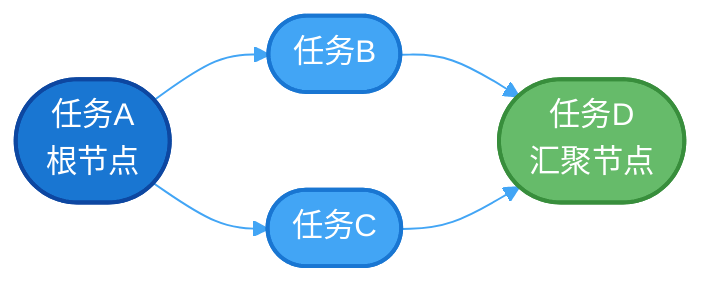
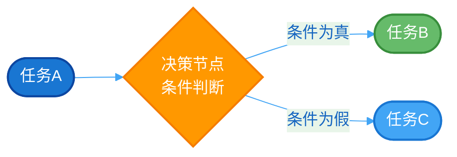

# 工作流

## 概述

工作流（Workflow）是 PowerJob 提供的任务编排能力，支持通过 DAG（有向无环图）的方式将多个任务节点串联起来，实现复杂的业务流程自动化。

## 核心概念

### DAG 结构

工作流采用 DAG（Directed Acyclic Graph）结构进行编排，由**节点**和**边**组成：



- **节点（Node）**：执行单元，可以是任务、决策或嵌套工作流
- **边（Edge）**：节点间的依赖关系，定义执行顺序

### 节点类型

| 节点类型 | 说明 | 适用场景 |
|---------|------|---------|
| **任务节点** | 执行具体的任务 | 业务逻辑处理 |
| **决策节点** | 基于条件判断后续流向 | 条件分支、动态路由 |
| **嵌套工作流** | 执行另一个工作流 | 流程复用、模块化设计 |

## 工作流状态

| 状态 | 值 | 说明 |
|------|---|------|
| WAITING | 1 | 等待调度 |
| RUNNING | 2 | 运行中 |
| FAILED | 3 | 执行失败 |
| SUCCEED | 4 | 执行成功 |
| STOPPED | 10 | 手动停止 |

## 参数传递

工作流支持在节点间传递数据，实现任务协同。

### 工作流上下文

```java
@Component
public class MyProcessor implements BasicProcessor {

    @Override
    public ProcessResult process(TaskContext context) throws Exception {
        // 获取工作流上下文
        WorkflowContext wfContext = context.getWorkflowContext();
        Map<String, String> contextData = wfContext.fetchWorkflowContext();

        // 读取上游节点传递的数据
        String value = contextData.get("key");

        // 向上下文追加数据，供下游节点使用
        wfContext.appendData2WfContext("result", "myResult");

        return new ProcessResult(true, "success");
    }
}
```

### 初始化参数

启动工作流时可传入初始参数：

```java
// 通过 OpenAPI 启动工作流
client.runWorkflow(workflowId, "{\"initParam\":\"value\"}", 0);
```

## 决策节点

决策节点通过 JavaScript/Groovy 脚本进行条件判断，根据返回值（`true`/`false`）决定后续执行路径。



**脚本示例：**

```javascript
// 获取工作流上下文
var context = workflowContext.fetchWorkflowContext();
var status = context.get("status");

// 返回 true 或 false
status === "success";
```

## 嵌套工作流

嵌套工作流节点允许在一个工作流中调用另一个工作流，支持：

- 流程复用
- 模块化设计
- 多层嵌套


## 错误处理

### 失败跳过

节点可配置「允许失败跳过」：

- **开启**：节点失败后自动跳过，工作流继续执行
- **关闭**：节点失败导致整个工作流失败

### 手动标记成功

对于失败且不允许跳过的节点，可手动标记为成功：

```java
// 通过 OpenAPI 标记节点成功
client.markWorkflowNodeAsSuccess(wfInstanceId, nodeId);
```

### 重试工作流

仅 `FAILED` 状态的工作流实例可重试：

```java
client.retryWorkflowInstance(wfInstanceId);
```

## 并发控制

通过 `maxWfInstanceNum` 限制同一工作流的最大并发实例数：

- **默认值**：1（串行执行）
- **超限策略**：可选择直接失败或排队等待

## 控制台操作

### 创建工作流

1. 进入「工作流管理」页面
2. 点击「新建工作流」
3. 配置基本信息和 DAG 结构
4. 保存并启用

### 运行工作流

- **定时触发**：配置 CRON 表达式自动触发
- **手动触发**：点击「运行」按钮立即执行
- **API 触发**：通过 OpenAPI 远程触发

## 最佳实践

1. **合理拆分**：将复杂流程拆分为多个独立任务
2. **错误容忍**：关键节点关闭失败跳过，非关键节点开启
3. **参数设计**：提前规划上下文数据的 key 命名规范
4. **并发控制**：根据资源情况合理设置最大并发数

## 下一步

- [工作流编排](/zh/advanced/workflow) - 学习如何在控制台编排工作流
- [OpenAPI 使用](/zh/api/openapi) - 通过 API 管理工作流
