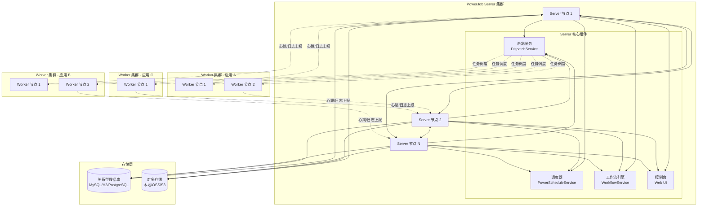
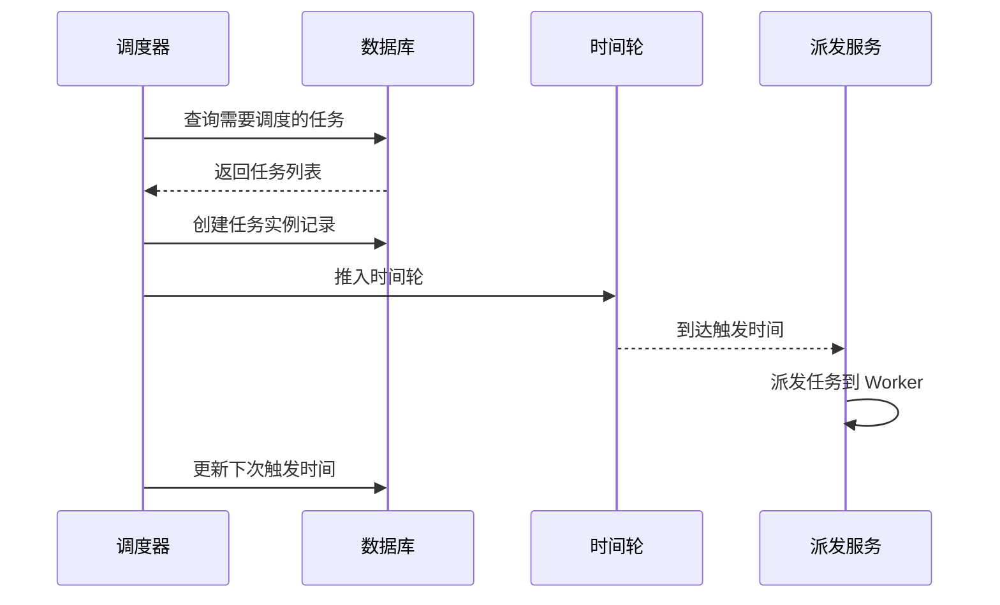
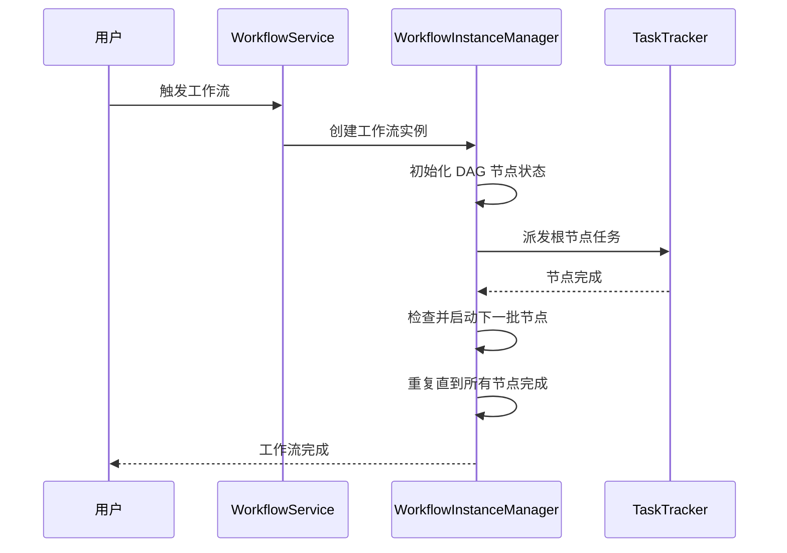
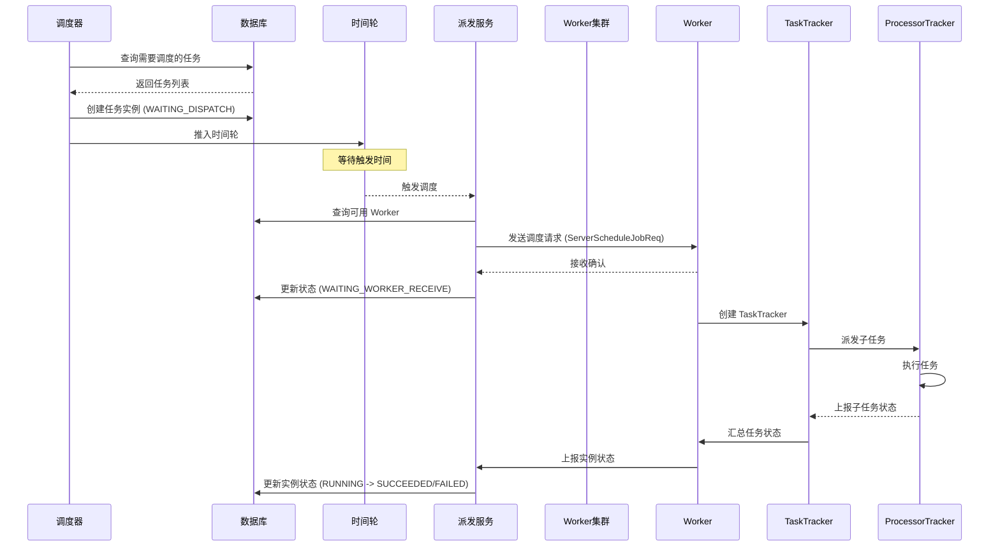
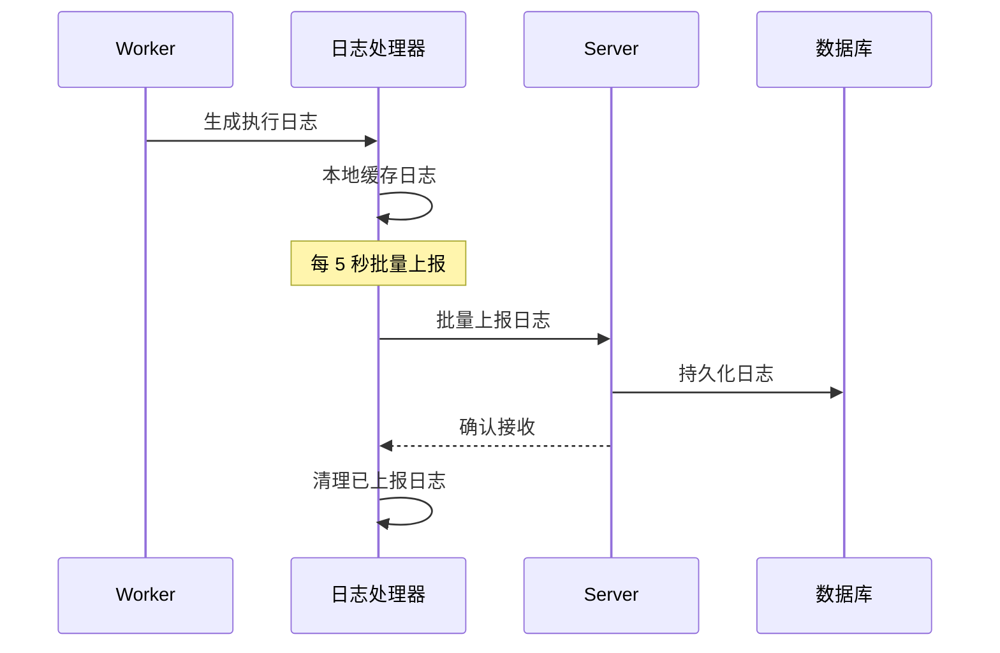
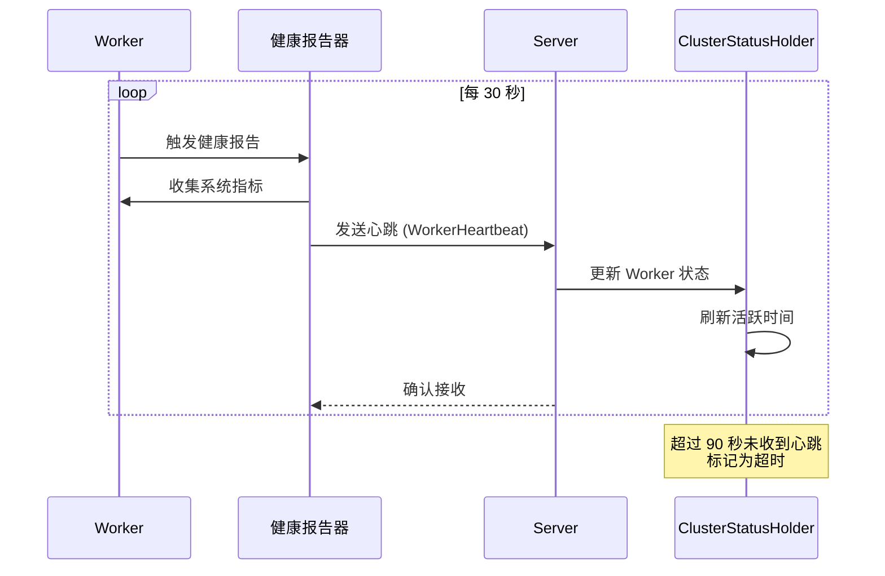

# 架构设计

## 整体架构

PowerJob 采用 **Server-Worker** 分离架构，支持水平扩展和高可用部署。



### 架构说明

PowerJob 的核心设计理念是将 **调度逻辑** 与 **执行逻辑** 分离：

- **Server（调度服务器）**：负责任务的调度、工作流编排、日志存储、控制台管理等功能
- **Worker（执行器）**：负责实际执行任务、上报日志、维持心跳等
- **存储层**：使用关系型数据库存储元数据，支持多种数据库（MySQL、PostgreSQL、H2、Oracle 等）

## 核心组件详解

### Server（调度服务器）

Server 是 PowerJob 的核心调度组件，采用分布式设计，支持集群部署。

#### 模块结构

```
powerjob-server/
├── powerjob-server-starter       # 启动器
├── powerjob-server-core          # 核心业务逻辑
├── powerjob-server-remote        # 远程通信
├── powerjob-server-persistence   # 持久化层
├── powerjob-server-auth          # 权限认证
├── powerjob-server-monitor       # 监控模块
├── powerjob-server-extension     # 扩展模块
├── powerjob-server-migrate       # 数据迁移
└── powerjob-server-common        # 公共模块
```

#### 调度器（PowerScheduleService）

调度器是 Server 的核心组件，负责任务的定时调度和触发。

**核心功能**：
- **CRON 调度**：基于 CRON 表达式的任务调度（`scheduleNormalJob`）
- **工作流调度**：支持 CRON 表达式的工作流调度（`scheduleCronWorkflow`）
- **固定频率调度**：支持固定频率和固定延迟的任务调度（`scheduleFrequentJob`）
- **时间轮调度**：使用时间轮实现高效的延迟调度

**调度流程**：



**关键设计**：
- **应用分组**：每个 Server 只负责部分应用的调度，实现负载均衡
- **批量处理**：每次最多处理 10 个应用的调度，避免单次查询压力过大
- **调度间隔**：默认 15 秒执行一次调度检查
- **超时检测**：检查调度耗时，超过调度间隔时发出警告

#### 工作流引擎（WorkflowService）

工作流引擎支持复杂的任务编排，基于 DAG（有向无环图）实现。

**核心功能**：
- **工作流定义**：创建、修改、复制工作流
- **DAG 校验**：校验工作流的 DAG 结构合法性
- **工作流执行**：启动工作流实例，管理节点依赖关系
- **节点管理**：支持任务节点的启用、禁用、失败跳过等配置

**工作流执行流程**：



#### 派发服务（DispatchService）

派发服务负责任务从 Server 到 Worker 的分发。

**核心流程**：
1. **实例检查**：检查任务状态，避免重复派发
2. **实例限制**：检查运行实例数，支持排队和失败策略
3. **Worker 选择**：选择合适的 Worker 节点
4. **超载检测**：过滤超载的 Worker
5. **任务派发**：通过网络发送任务请求

**派发策略**：
- **单机执行**：选择一个最优的 Worker
- **广播执行**：派发到所有可用 Worker
- **MapReduce**：派发到多个 Worker，支持任务分片

#### 状态检查服务（InstanceStatusCheckService）

状态检查服务确保任务执行的可靠性，定期检查任务状态并进行异常处理。

**检查项**：
- **WAITING_DISPATCH 检查**：检查等待派发的任务（超时 30 秒）
- **WAITING_WORKER_RECEIVE 检查**：检查等待 Worker 接收的任务（超时 60 秒）
- **RUNNING 检查**：检查运行中的任务心跳（超时 60 秒）
- **工作流实例检查**：检查长时间等待的工作流实例（超时 60 秒）

**处理策略**：
- 重新派发超时任务
- 根据重试配置决定是否重试
- 超过重试次数则标记为失败

### Worker（执行器）

Worker 是 PowerJob 的执行组件，负责实际执行任务并上报状态。

#### 模块结构

```
powerjob-worker/
├── actors               # Actor 模型处理器
│   ├── WorkerActor              # Worker 主 Actor
│   ├── TaskTrackerActor         # 任务追踪器 Actor
│   └── ProcessorTrackerActor    # 处理器追踪器 Actor
├── core                 # 核心逻辑
│   ├── executor                 # 任务执行器
│   ├── tracker                  # 任务追踪器
│   ├── processor                # 处理器加载
│   └── ha                       # 高可用支持
├── background           # 后台服务
│   ├── heartbeat                # 心跳上报
│   └── discovery                # Server 发现
├── log                  # 日志上报
├── persistence          # 本地存储
├── container            # 容器支持
└── processor            # 处理器实现
```

#### 核心组件

**PowerJobWorker**：Worker 启动类，负责初始化所有组件

**初始化流程**：
1. 解析本地 IP 和端口
2. 校验 appName，获取应用信息
3. 初始化线程池
4. 初始化 ProcessorLoader（处理器加载器）
5. 初始化 Actor 系统
6. 启动远程通信引擎
7. 初始化日志系统
8. 初始化本地存储
9. 启动定时任务（心跳上报、日志上报）

**WorkerActor**：Worker 主入口，处理来自 Server 的请求

- 处理容器部署/销毁请求
- 处理 Worker 注册请求

**TaskTrackerActor**：任务追踪器，负责任务实例的管理

- 接收 Server 的任务调度请求
- 区分轻量级和重量级任务
- 创建和管理 TaskTracker
- 处理任务状态上报
- 处理任务 Map 请求
- 响应任务查询和停止请求

**ProcessorTrackerActor**：处理器追踪器

- 启动任务执行
- 停止任务实例

#### 任务模型

Worker 支持两种任务模型：

**轻量级任务（LightTaskTracker）**：
- 适用于单机执行的 CRON 任务
- 资源占用更小
- 执行效率更高

**重量级任务（HeavyTaskTracker）**：
- 适用于广播、MapReduce 等复杂场景
- 支持任务分片
- 支持任务 Map 操作
- 支持两级状态上报

### Remote（通信框架）

PowerJob 的通信框架采用分层设计，支持多种通信协议。

#### 架构设计

```
┌─────────────────────────────────────────────────────────┐
│                    应用层 (Actor)                        │
├─────────────────────────────────────────────────────────┤
│                 Remote Framework                        │
│  ┌─────────────┐  ┌─────────────┐  ┌─────────────┐      │
│  │   Actor     │  │  Transporter│  │    URL      │      │
│  └─────────────┘  └─────────────┘  └─────────────┘      │
├─────────────────────────────────────────────────────────┤
│              协议实现层                                   │
│  ┌─────────────┐  ┌─────────────┐  ┌─────────────┐      │
│  │    AKKA     │  │    HTTP     │  │     MU      │      │
│  └─────────────┘  └─────────────┘  └─────────────┘      │
└─────────────────────────────────────────────────────────┘
```

#### 支持的协议

**AKKA 协议**：
- 基于 Actor 模型
- 高性能、低延迟
- 支持双向通信
- 默认推荐协议

**HTTP 协议**：
- 基于 HTTP/1.1
- 兼容性好，易于调试
- 适合网络受限环境

**MU 协议**：
- 基于 Netty
- 高性能异步通信

#### 通信路径定义

```java
// Server-Server 通信
S4S_PATH = "friend"
S4S_HANDLER_PING = "ping"                    // 集群间心跳
S4S_HANDLER_PROCESS = "process"              // 集群间请求处理

// Server-Worker 通信
S4W_PATH = "server"
S4W_HANDLER_REPORT_LOG = "reportLog"         // 日志上报
S4W_HANDLER_WORKER_HEARTBEAT = "workerHeartbeat"  // 心跳
S4W_HANDLER_REPORT_INSTANCE_STATUS = "reportInstanceStatus"  // 实例状态
S4W_HANDLER_QUERY_JOB_CLUSTER = "queryJobCluster"  // 查询集群
S4W_HANDLER_WORKER_NEED_DEPLOY_CONTAINER = "queryContainer"  // 容器部署

// Worker TaskTracker 通信
WTT_PATH = "taskTracker"
WTT_HANDLER_RUN_JOB = "runJob"               // 任务调度
WTT_HANDLER_STOP_INSTANCE = "stopInstance"   // 停止实例
WTT_HANDLER_QUERY_INSTANCE_STATUS = "queryInstanceStatus"  // 查询状态
WTT_HANDLER_REPORT_TASK_STATUS = "reportTaskStatus"  // 任务状态
WTT_HANDLER_REPORT_PROCESSOR_TRACKER_STATUS = "reportProcessorTrackerStatus"  // PT 状态
WTT_HANDLER_MAP_TASK = "mapTask"             // Map 任务

// Worker ProcessorTracker 通信
WPT_PATH = "processorTracker"
WPT_HANDLER_START_TASK = "startTask"         // 启动任务
WPT_HANDLER_STOP_INSTANCE = "stopInstance"   // 停止实例
```

## 数据流

### 任务调度流程



### 日志上报流程



### 心跳保活流程



## 高可用设计

### Server 高可用

**集群部署**：
- 多个 Server 节点组成集群
- 通过数据库实现状态共享
- 支持动态增减节点

**应用分组**：
- 每个应用分配给特定的 Server 节点
- 应用组支持重新分配
- 故障节点自动切换

**无锁化调度**：
- 基于时间轮实现延迟调度
- 避免分布式锁的性能开销
- 支持高并发调度

### Worker 高可用

**集群部署**：
- 同一应用部署多个 Worker 节点
- Server 自动选择健康节点
- 支持节点故障隔离

**任务重试**：
- 支持实例级别重试
- 可配置重试次数
- 失败自动重新派发

**超时检测**：
- 定期检查运行中任务
- 心跳超时自动标记失败
- 支持任务重新派发

### 故障恢复机制

**Server 故障恢复**：
- 等待派发的任务：状态检查服务重新派发
- 运行中的任务：Worker 继续执行，状态上报到其他 Server
- 时间轮中的任务：其他 Server 重新调度

**Worker 故障恢复**：
- Server 检测到 Worker 超时
- 将运行中的任务标记为失败
- 根据配置决定是否重试
- 重新派发到健康 Worker

**网络故障恢复**：
- 请求超时自动重试
- 日志缓存本地，网络恢复后补发
- 心跳断线自动重连

## 扩展性设计

### 水平扩展

**Server 扩展**：
- 通过增加 Server 节点提升调度能力
- 应用自动重新分组
- 无需人工干预

**Worker 扩展**：
- 通过增加 Worker 节点提升执行能力
- 自动注册到 Server
- 负载自动均衡

### 性能优化

**无锁化调度**：
- 使用时间轮替代定时任务
- 减少数据库查询压力
- 提升调度吞吐量

**批量处理**：
- 批量查询任务
- 批量更新状态
- 批量上报日志

**缓存优化**：
- 任务信息缓存
- Worker 集群信息缓存
- 减少数据库访问

**异步处理**：
- 异步派发任务
- 异步上报日志
- 异步更新状态

## 技术选型

### 核心技术

| 技术 | 版本 | 用途 | 选型原因 |
|------|------|------|----------|
| Spring Boot | 2.7.18 | 应用框架 | 成熟稳定、生态丰富 |
| Spring Data JPA | 2.7.18 | 数据访问 | 简化数据库操作 |
| AKKA | - | 远程通信 | Actor 模型、高性能 |
| Netty | - | 网络通信 | 高性能异步框架 |
| HikariCP | - | 连接池 | 高性能连接池 |

### 数据库支持

- MySQL 8.0+
- PostgreSQL 42.6+
- Oracle 19c+
- SQL Server
- DB2
- H2（测试/开发）

### 序列化方式

- JSON（默认）
- Protobuf（可选）
- Hessian（可选）

### 存储扩展

- 本地文件系统
- 阿里云 OSS
- AWS S3
- MongoDB（容器存储）

## 数据库设计

### 核心表结构

**应用信息（app_info）**：
- 存储应用基本信息
- 关联 Server 节点

**任务信息（job_info）**：
- 存储任务配置信息
- 包含调度策略、执行策略等

**任务实例（instance_info）**：
- 存储任务执行记录
- 记录执行状态和结果

**工作流信息（workflow_info）**：
- 存储工作流配置
- 包含 DAG 结构

**工作流实例（workflow_instance_info）**：
- 存储工作流执行记录
- 记录节点执行状态

**Worker 集群（worker_cluster_info）**：
- 存储 Worker 集群状态
- 维护心跳信息

### 状态机

**任务实例状态**：
```
WAITING_DISPATCH -> WAITING_WORKER_RECEIVE -> RUNNING -> SUCCEEDED/FAILED/STOPPED
                                         -> FAILED
                                         -> CANCELED
```

**工作流实例状态**：
```
WAITING -> RUNNING -> SUCCEEDED/FAILED/STOPPED
```

## 下一步

- [任务](/zh/core/task.md) - 了解任务的概念
- [执行器](/zh/advanced/worker.md) - 了解执行器的配置
