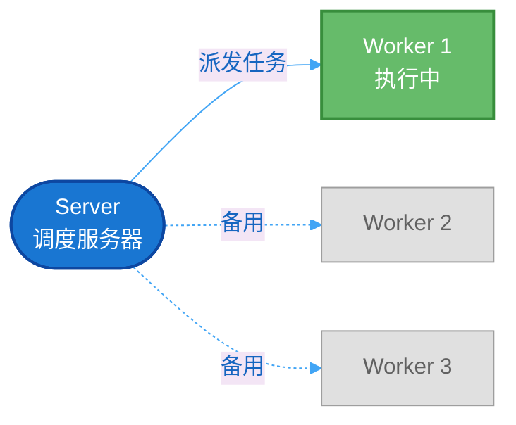
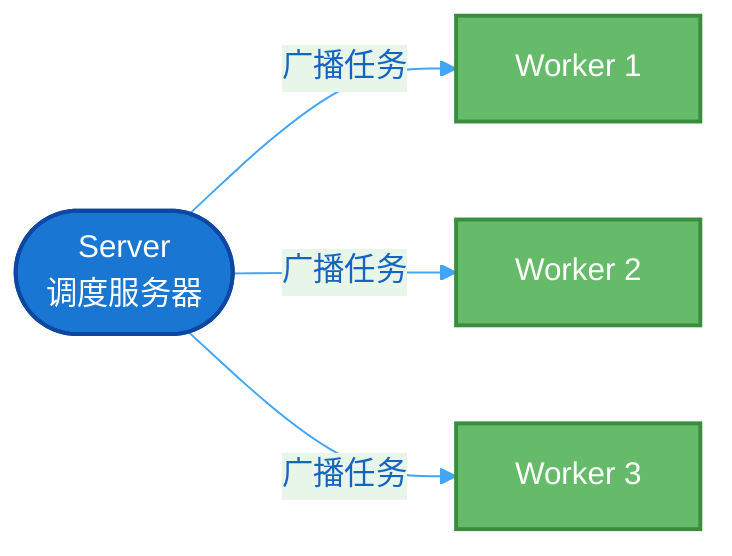
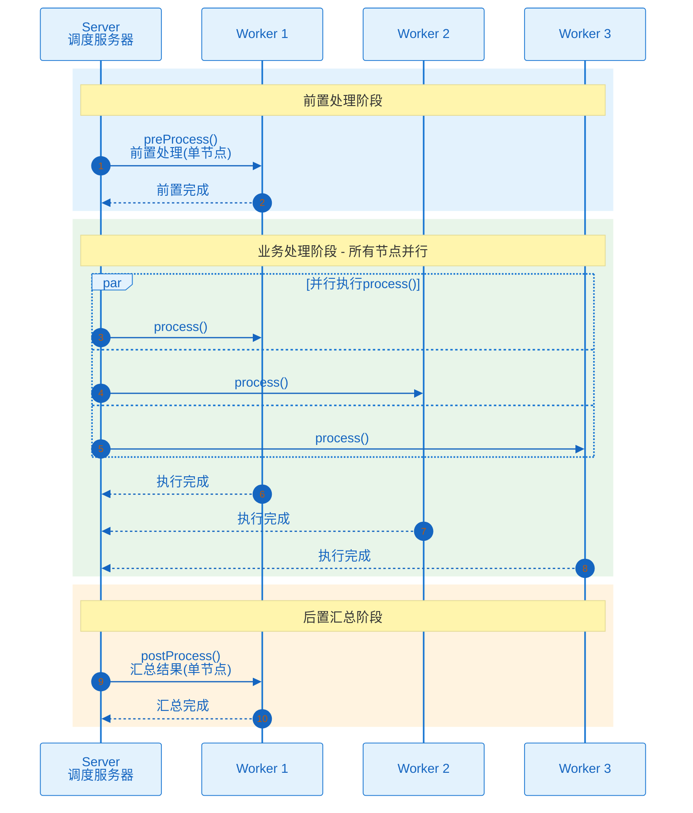
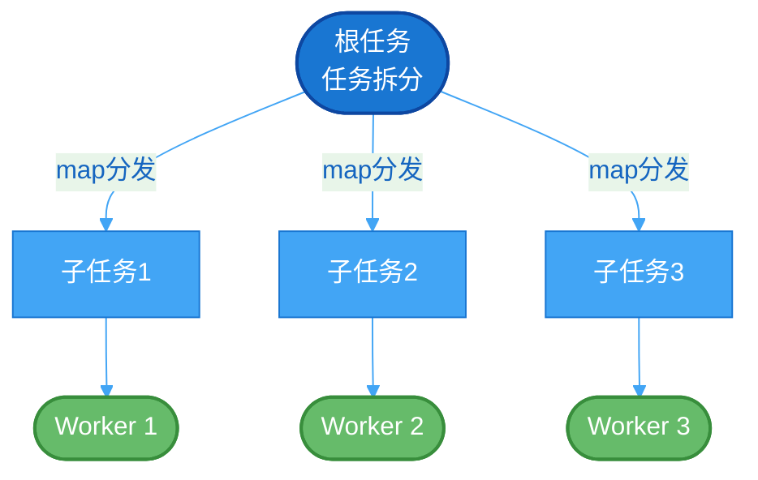
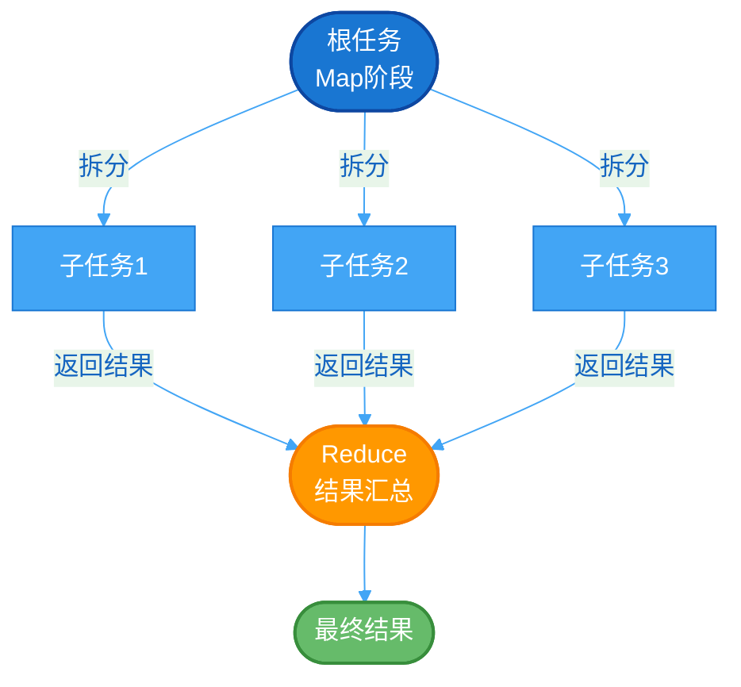
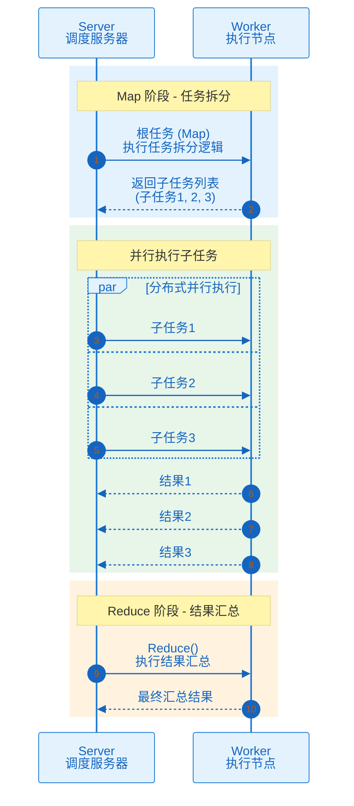

# 执行模式

## 概述

PowerJob 提供四种执行模式，支持从单机到分布式的各种任务场景。

## 模式概览

| 执行模式 | 枚举值 | 说明 | 适用场景 |
|---------|-------|------|---------|
| 单机执行 | 1 | 在单个 Worker 节点执行 | 简单任务、数据量小 |
| 广播执行 | 2 | 在所有 Worker 节点执行 | 配置同步、缓存清理 |
| Map | 4 | 任务拆分，不汇总结果 | 批量处理、并行执行 |
| MapReduce | 3 | 任务拆分并汇总结果 | 统计计算、数据聚合 |

## 单机执行（STANDALONE）

最简单的执行模式，任务在单个 Worker 节点上执行。



### 处理器接口

```java
@Component
public class StandaloneProcessor implements BasicProcessor {

    @Override
    public ProcessResult process(TaskContext context) throws Exception {
        String jobParams = context.getJobParams();

        // 执行业务逻辑
        doSomething(jobParams);

        return new ProcessResult(true, "执行成功");
    }
}
```

### 适用场景

- 数据量小的任务
- 无需并行处理的任务
- 快速执行的单机任务

## 广播执行（BROADCAST）

任务在所有可用的 Worker 节点上并行执行，支持前置和后置处理。



### 处理器接口

```java
@Component
public class BroadcastProcessorDemo implements BroadcastProcessor {

    @Override
    public ProcessResult preProcess(TaskContext context) throws Exception {
        // 前置处理：只在单个节点执行一次
        log.info("广播任务开始，参数：{}", context.getJobParams());
        return new ProcessResult(true);
    }

    @Override
    public ProcessResult process(TaskContext context) throws Exception {
        // 业务处理：在所有节点执行
        String param = context.getJobParams();
        // 例如：清除本机缓存
        cacheManager.clearAll();
        return new ProcessResult(true, "缓存已清除");
    }

    @Override
    public ProcessResult postProcess(TaskContext context, List<TaskResult> taskResults) throws Exception {
        // 后置处理：汇总所有节点的执行结果
        long successCount = taskResults.stream()
            .filter(TaskResult::isSuccess)
            .count();
        return new ProcessResult(true, "成功节点数：" + successCount);
    }
}
```

### 执行流程



### 适用场景

- 在所有节点执行相同操作（如清除缓存、刷新配置）
- 需要全局一致性的操作
- 分布式环境中的批量操作

## Map 模式

支持任务拆分，将大任务分解为多个子任务并行执行，不进行结果汇总。



### 处理器接口

```java
@Component
public class MapProcessorDemo implements MapProcessor {

    @Override
    public ProcessResult process(TaskContext context) throws Exception {
        if (isRootTask()) {
            // 根任务：拆分任务
            List<Long> userIds = loadAllUserIds();

            // 分批处理，每批 200 条
            List<List<Long>> batches = Lists.partition(userIds, 200);

            for (int i = 0; i < batches.size(); i++) {
                map(batches.get(i), "batch-" + i);
            }

            return new ProcessResult(true, "任务已拆分");
        }

        // 子任务：处理具体数据
        List<Long> batchIds = (List<Long>) context.getSubTask();
        for (Long userId : batchIds) {
            processUser(userId);
        }

        return new ProcessResult(true, "处理完成：" + batchIds.size());
    }
}
```

### 关键方法

| 方法 | 说明 |
|-----|------|
| `isRootTask()` | 判断是否为根任务 |
| `map(List, String)` | 拆分任务并分发到 Worker |

### 适用场景

- 大规模数据处理（如批量更新数据库）
- 文件批量处理（如日志分析）
- 需要自定义分片逻辑的任务

## MapReduce 模式

在 Map 模式基础上增加了 Reduce 阶段，支持结果汇总。



### 处理器接口

```java
@Component
public class MapReduceProcessorDemo implements MapReduceProcessor {

    @Override
    public ProcessResult process(TaskContext context) throws Exception {
        if (isRootTask()) {
            // Map 阶段：拆分任务
            List<File> files = loadFiles();
            for (File file : files) {
                map(file, "process-file");
            }
            return new ProcessResult(true, "Map 完成");
        }

        // 子任务：处理文件
        File file = (File) context.getSubTask();
        int count = countLines(file);
        return new ProcessResult(true, String.valueOf(count));
    }

    @Override
    public ProcessResult reduce(TaskContext context, List<TaskResult> taskResults) throws Exception {
        // Reduce 阶段：汇总结果
        long totalCount = 0;
        for (TaskResult result : taskResults) {
            if (result.isSuccess()) {
                totalCount += Long.parseLong(result.getResult());
            }
        }
        return new ProcessResult(true, "总行数：" + totalCount);
    }
}
```

### 执行流程



### 适用场景

- 需要结果汇总的批量计算
- 数据聚合任务（如报表生成）
- 统计分析任务

## TaskContext 常用属性

| 属性 | 类型 | 说明 |
|-----|------|------|
| jobParams | String | 控制台配置的静态参数 |
| instanceParams | String | 运行时参数（API 或工作流传入） |
| subTask | Object | 子任务对象（Map/MapReduce 模式） |
| currentRetryTimes | int | 当前重试次数 |
| omsLogger | OmsLogger | 在线日志记录器 |
| workflowContext | WorkflowContext | 工作流上下文 |

## ProcessResult 使用

```java
// 成功
new ProcessResult(true, "执行成功");

// 失败
new ProcessResult(false, "执行失败原因");

// 广播模式汇总
ProcessResult.defaultResult(taskResults);
```

## 最佳实践

### 选择执行模式

| 数据量 | 是否需要汇总 | 推荐模式 |
|-------|-------------|---------|
| 小 | - | 单机执行 |
| - | 需要全节点执行 | 广播执行 |
| 大 | 否 | Map |
| 大 | 是 | MapReduce |

### 分片建议

- 子任务批次大小建议 **200** 个/批
- 避免网络过载
- 合理利用 Worker 资源

### 性能优化

- MapReduce 模式注意内存使用
- 大规模任务考虑流式处理
- 合理设置任务超时时间

## 下一步

- [处理器开发](/zh/core/processor) - 学习如何开发处理器
- [任务运维](/zh/ops/operation) - 了解任务运维操作
