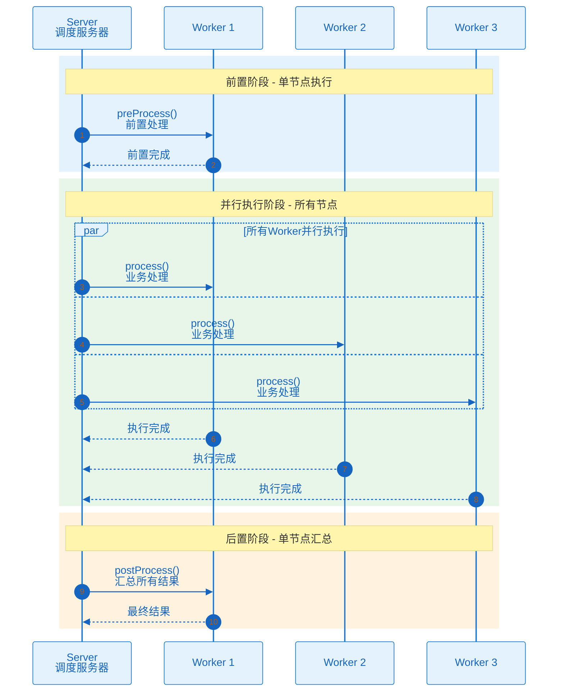
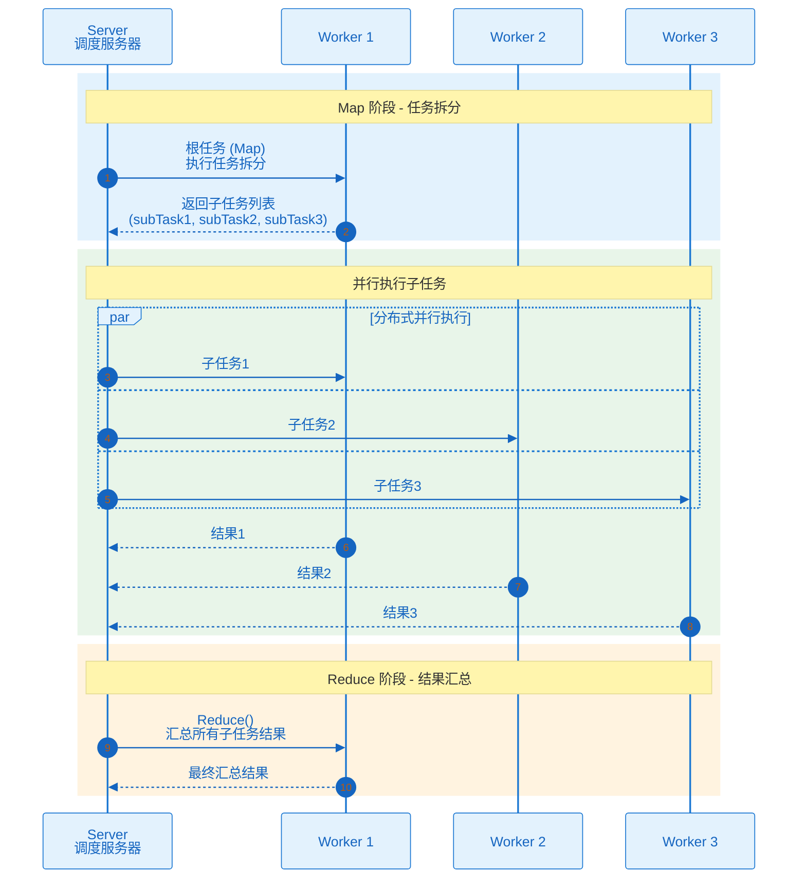

# 处理器开发
## 概述
处理器（Processor）是 PowerJob 执行任务的核心组件，开发者通过实现不同的处理器接口来完成各种业务场景的任务处理。

## 处理器类型
| 处理器接口 | 执行模式 | 说明 |
|-------------|-------|------|
| BasicProcessor | 单机 | 最基础的处理器，执行单机任务 |
| BroadcastProcessor | 广播 | 在所有节点执行，支持前置/后置处理 |
| MapProcessor | Map | 支持任务拆分，不汇总结果 |
| MapReduceProcessor | MapReduce | 支持任务拆分和结果汇总 |

## BasicProcessor
最基础的处理器接口，适用于单机执行模式。
### 接口定义
```java
public interface BasicProcessor {
    ProcessResult process(TaskContext context) throws Exception;
}
```
### 使用示例
```java
@Component
public class SimpleProcessor implements BasicProcessor {

    @Override
    public ProcessResult process(TaskContext context) throws Exception {
        OmsLogger logger = context.getOmsLogger();
        String jobParams = context.getJobParams();

        logger.info("开始执行任务，参数：{}", jobParams);

        // 执行业务逻辑
        doBusiness(jobParams);

        return new ProcessResult(true, "执行成功");
    }

    private void doBusiness(String params) {
        // 业务逻辑实现
    }
}
```
## BroadcastProcessor
广播处理器，在所有 Worker 节点上执行任务。
### 接口定义
```java
public interface BroadcastProcessor extends BasicProcessor {
    default ProcessResult preProcess(TaskContext context) throws Exception {
        return new ProcessResult(true);
    }
    default ProcessResult postProcess(TaskContext context, List<TaskResult> taskResults) throws Exception {
        return ProcessResult.defaultResult(taskResults);
    }
}
```
### 使用示例
```java
@Component
public class CacheClearProcessor implements BroadcastProcessor {

    @Override
    public ProcessResult preProcess(TaskContext context) throws Exception {
        context.getOmsLogger().info("开始清理所有节点缓存");
        return new ProcessResult(true);
    }

    @Override
    public ProcessResult process(TaskContext context) throws Exception {
        // 清理本节点缓存
        cacheManager.clearAll();
        return new ProcessResult(true, "缓存已清理");
    }

    @Override
    public ProcessResult postProcess(TaskContext context, List<TaskResult> taskResults) throws Exception {
        long successCount = taskResults.stream()
            .filter(TaskResult::isSuccess)
            .count();
        return new ProcessResult(true, "成功清理 " + successCount + " 个节点");
    }
}
```
### 执行流程

## MapProcessor
Map 处理器，支持任务拆分和分布式执行。
### 接口定义
```java
public interface MapProcessor extends BasicProcessor {

    int RECOMMEND_BATCH_SIZE = 200;

    default void map(List<?> taskList, String taskName) throws PowerJobCheckedException {
        // 内部实现
    }

    default boolean isRootTask() {
        TaskDO task = ThreadLocalStore.getTask();
        return TaskConstant.ROOT_TASK_NAME.equals(task.getTaskName());
    }
}
```
### 使用示例
```java
@Component
public class BatchProcessProcessor implements MapProcessor {

    @Override
    public ProcessResult process(TaskContext context) throws Exception {
        if (isRootTask()) {
            // 根任务：拆分任务
            List<Long> allIds = loadAllIds();
            List<List<Long>> batches = Lists.partition(allIds, 200);

            for (int i = 0; i < batches.size(); i++) {
                map(batches.get(i), "batch-" + i);
            }
            return new ProcessResult(true, "任务已拆分为 " + batches.size() + " 批");
        }

        // 子任务：处理具体数据
        List<Long> batchIds = (List<Long>) context.getSubTask();
        for (Long id : batchIds) {
                processItem(id);
        }
        return new ProcessResult(true, "处理完成：" + batchIds.size());
    }
}
```
### 关键方法
| 方法 | 说明 |
|-----|------|
| `map(List, String)` | 拆分任务并分发到 Worker |
| `isRootTask()` | 判断是否为根任务 |
## MapReduceProcessor
MapReduce 处理器，在 Map 基础上增加结果汇总能力。
### 接口定义
```java
public interface MapReduceProcessor extends MapProcessor {
    ProcessResult reduce(TaskContext context, List<TaskResult> taskResults);
}
```
### 使用示例
```java
@Component
public class StatisticsProcessor implements MapReduceProcessor {

    @Override
    public ProcessResult process(TaskContext context) throws Exception {
        if (isRootTask()) {
            // Map 阶段：拆分任务
            List<DataChunk> chunks = loadDataChunks();
            for (DataChunk chunk : chunks) {
                map(chunk, "process-chunk");
            }
            return new ProcessResult(true, "Map 完成");
        }

        // 子任务：处理数据块
        DataChunk chunk = (DataChunk) context.getSubTask();
        int count = processChunk(chunk);
        return new ProcessResult(true, String.valueOf(count));
    }

    @Override
    public ProcessResult reduce(TaskContext context, List<TaskResult> taskResults) throws Exception {
        // Reduce 阶段：汇总结果
        long totalCount = 0;
        for (TaskResult result : taskResults) {
            if (result.isSuccess()) {
                totalCount += Long.parseLong(result.getResult());
            }
        }
        return new ProcessResult(true, "总计：" + totalCount);
    }
}
```
### 执行流程

## TaskContext 详解
### 核心属性
| 属性 | 类型 | 说明 |
|-----|------|------|
| jobId | Long | 任务 ID |
| instanceId | Long | 任务实例 ID |
| subInstanceId | Long | 子实例 ID（MapReduce 模式） |
| taskId | String | 任务 ID |
| taskName | String | 任务名称 |
| jobParams | String | 控制台配置的静态参数 |
| instanceParams | String | 运行时参数（API 或工作流传入） |
| subTask | Object | 子任务对象（Map/MapReduce 模式） |
| maxRetryTimes | int | 最大重试次数 |
| currentRetryTimes | int | 当前重试次数 |
| omsLogger | OmsLogger | 在线日志记录器 |
| workflowContext | WorkflowContext | 工作流上下文 |
| userContext | Object | 用户自定义上下文 |
| instanceMeta | InstanceMeta | 调度元信息 |
### 常用方法
```java
// 获取参数
String jobParams = context.getJobParams();
String instanceParams = context.getInstanceParams();

Object subTask = context.getSubTask();
// 获取日志记录器
OmsLogger logger = context.getOmsLogger();
logger.info("信息日志");
logger.error("错误日志");
// 获取工作流上下文
WorkflowContext wfContext = context.getWorkflowContext();
Map<String, String> data = wfContext.fetchWorkflowContext();
wfContext.appendData2WfContext("key", "value");
```
## ProcessResult 使用
### 枸造方法
```java
// 成功
new ProcessResult(true, "执行成功");
// 失败
new ProcessResult(false, "执行失败：原因");
// 仅有状态
new ProcessResult(true);
new ProcessResult(false);
```
### 使用规范
- **不允许返回 null**
- **消息长度有限制**，超长会被截断
- **推荐在处理器内处理异常**
```java
try {
    // 业务逻辑
    return new ProcessResult(true, "success");
} catch (Exception e) {
    return new ProcessResult(false, e.getMessage());
}
```
## 开发最佳实践
### 1. 合理使用日志
```java
OmsLogger logger = context.getOmsLogger();
logger.info("关键步骤开始");
// 业务逻辑
logger.info("关键步骤完成，结果：{}", result);
```
### 2. 参数校验
```java
@Override
public ProcessResult process(TaskContext context) throws Exception {
    String params = context.getJobParams();
    if (StringUtils.isEmpty(params)) {
        return new ProcessResult(false, "参数不能为空");
    }
    // 业务逻辑
}
```
### 3. 异常处理
```java
try {
    return doRiskyOperation();
} catch (BusinessException e) {
    return new ProcessResult(false, "业务异常：" + e.getMessage());
} catch (Exception e) {
    context.getOmsLogger().error("系统异常", e);
    return new ProcessResult(false, "系统异常");
}
```
### 4. 性能优化
```java
// 批量处理，减少数据库交互
List<List<Item>> batches = Lists.partition(items, 100);
for (List<Item> batch : batches) {
    processBatch(batch);
}
```
## 方法级别处理器
使用 `@PowerJobHandler` 注解可以将 Spring 方法注册为处理器。
### 使用示例
```java
@Component
public class MyService {

    @PowerJobHandler(name = "greetingHandler")
    public String greeting(TaskContext context) {
        return "Hello, " + context.getJobParams();
    }
}
```
### 控制台配置
处理器信息填写： `SpringBean名称#方法名`

```
myService#greetingHandler
```
## 下一步
- [执行模式](/zh/core/execution-mode) - 了解不同执行模式
- [Spring Boot 集成](/zh/integration/spring-boot) - Spring Boot 集成配置
