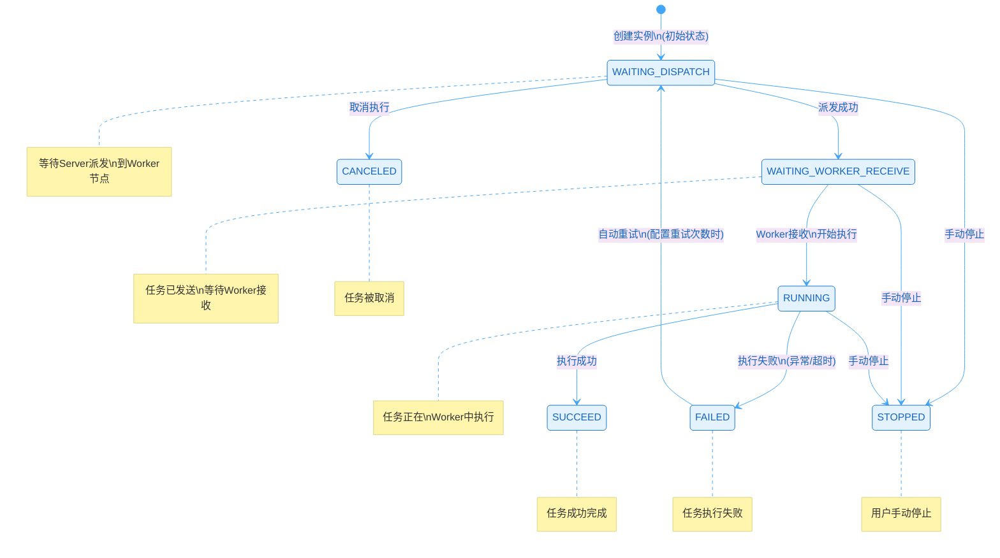

# 任务运维

## 概述

PowerJob 提供完善的任务运维能力，包括手动触发、停止、重试、查看日志等操作。

## 任务实例状态

### 状态流转



### 状态说明

| 状态 | 值 | 说明 |
|------|---|------|
| WAITING_DISPATCH | 1 | 等待派发 |
| WAITING_WORKER_RECEIVE | 2 | 等待 Worker 接收 |
| RUNNING | 3 | 运行中 |
| FAILED | 4 | 执行失败 |
| SUCCEED | 5 | 执行成功 |
| CANCELED | 9 | 已取消 |
| STOPPED | 10 | 手动停止 |

## 手动触发任务

### 控制台操作

1. 进入「任务管理」页面
2. 找到目标任务，点击「运行」按钮
3. 可选填写运行参数
4. 确认执行

### OpenAPI 调用

```java
// 基础触发
ResultDTO<Long> result = client.runJob(jobId, null, 0);

// 带参数触发
ResultDTO<Long> result = client.runJob(jobId, "{\"key\":\"value\"}", 0);

// 延迟60秒执行
ResultDTO<Long> result = client.runJob(jobId, "params", 60000);

// 完整参数触发
RunJobRequest request = new RunJobRequest()
    .setJobId(jobId)
    .setInstanceParams("{\"orderId\":\"123\"}")
    .setDelay(0L)
    .setOuterKey("business-id-123"); // 业务关联ID

PowerResultDTO<Long> result = client.runJob(request);
```

### 参数说明

| 参数 | 说明 |
|-----|------|
| jobId | 任务 ID |
| instanceParams | 实例参数（覆盖 jobParams） |
| delay | 延迟执行时间（毫秒） |
| outerKey | 外部业务关联 ID |

## 停止任务

### 控制台操作

1. 进入「运行实例」页面
2. 找到运行中的实例
3. 点击「停止」按钮

### OpenAPI 调用

```java
// 停止任务实例
ResultDTO<Void> result = client.stopInstance(instanceId);

// 取消尚未开始的实例
ResultDTO<Void> result = client.cancelInstance(instanceId);
```

### 停止条件

- 仅 `WAITING_DISPATCH`、`WAITING_WORKER_RECEIVE`、`RUNNING` 状态可停止
- 已完成的实例无法停止

## 重试任务

### 控制台操作

1. 进入「运行实例」页面
2. 找到失败的实例
3. 点击「重试」按钮

### OpenAPI 调用

```java
// 重试失败的任务实例
ResultDTO<Void> result = client.retryInstance(instanceId);
```

### 重试机制

- 仅 `FAILED` 状态的实例可重试
- 重试会延迟 10 秒执行，避免资源冲突
- 重试次数会计入 `runningTimes`

### 重试配置

任务创建时可配置自动重试：

```java
SaveJobInfoRequest request = new SaveJobInfoRequest();
request.setInstanceRetryNum(3);  // 实例级重试次数
request.setTaskRetryNum(2);      // 任务级重试次数（Map/MapReduce）
```

## 查看日志

### 控制台操作

1. 进入「运行实例」页面
2. 点击实例的「日志」按钮
3. 支持实时查看和分页浏览
4. 可下载完整日志文件

### 日志使用示例

```java
@Component
public class LogDemoProcessor implements BasicProcessor {

    @Override
    public ProcessResult process(TaskContext context) throws Exception {
        // 获取在线日志记录器
        OmsLogger logger = context.getOmsLogger();

        logger.info("任务开始执行");
        logger.info("参数：{}", context.getJobParams());

        try {
            // 业务逻辑
            doSomething();
            logger.info("任务执行成功");
        } catch (Exception e) {
            logger.error("任务执行失败", e);
            return new ProcessResult(false, e.getMessage());
        }

        return new ProcessResult(true, "success");
    }
}
```

### 日志配置

```java
SaveJobInfoRequest request = new SaveJobInfoRequest();

LogConfig logConfig = new LogConfig();
logConfig.setType(LogConfig.LOG_TYPE_ONLINE);
logConfig.setLevel(LogConfig.LOG_LEVEL_INFO);

request.setLogConfig(logConfig);
```

## 查看实例详情

### OpenAPI 查询

```java
// 查询实例状态
ResultDTO<Integer> status = client.fetchInstanceStatus(instanceId);

// 查询实例详情
ResultDTO<InstanceInfoDTO> info = client.fetchInstanceInfo(instanceId);

// 分页查询实例列表
InstancePageQuery query = new InstancePageQuery()
    .setJobIdEq(123L)
    .setStatusIn(Lists.newArrayList(3, 4))  // RUNNING, FAILED
    .setSortBy("actualTriggerTime")
    .setAsc(false)
    .setPageSize(20);

ResultDTO<PageResult<InstanceInfoDTO>> result = client.queryInstanceInfo(query);
```

### 实例信息字段

| 字段 | 说明 |
|-----|------|
| instanceId | 实例 ID |
| jobId | 任务 ID |
| status | 实例状态 |
| result | 执行结果 |
| actualTriggerTime | 实际触发时间 |
| finishedTime | 完成时间 |
| runningTimes | 运行次数 |
| taskTrackerAddress | 执行节点地址 |

## 工作流运维

### 停止工作流实例

```java
ResultDTO<Void> result = client.stopWorkflowInstance(wfInstanceId);
```

### 重试工作流实例

```java
ResultDTO<Void> result = client.retryWorkflowInstance(wfInstanceId);
```

### 标记节点成功

对于失败的工作流节点，可手动标记为成功：

```java
ResultDTO<Void> result = client.markWorkflowNodeAsSuccess(wfInstanceId, nodeId);
```

### 查询工作流实例

```java
ResultDTO<WorkflowInstanceInfoDTO> info = client.fetchWorkflowInstanceInfo(wfInstanceId);
```

## 运维最佳实践

### 1. 合理设置重试

```java
// 对于可能偶尔失败的任务
request.setInstanceRetryNum(3);

// 对于关键任务，增加重试次数
request.setInstanceRetryNum(5);
```

### 2. 设置超时时间

```java
// 设置实例超时时间（毫秒）
request.setInstanceTimeLimit(3600000L);  // 1小时
```

### 3. 添加日志记录

```java
OmsLogger logger = context.getOmsLogger();
logger.info("关键步骤完成，进度：{}%", progress);
```

### 4. 异常处理

```java
try {
    // 业务逻辑
} catch (BusinessException e) {
    // 业务异常，记录后返回失败
    logger.error("业务异常：{}", e.getMessage());
    return new ProcessResult(false, e.getMessage());
} catch (Exception e) {
    // 系统异常，记录堆栈
    logger.error("系统异常", e);
    return new ProcessResult(false, "系统异常：" + e.getMessage());
}
```

## 下一步

- [报警通知](/zh/ops/alert) - 配置任务告警
- [OpenAPI 使用](/zh/api/openapi) - 通过 API 进行运维操作
